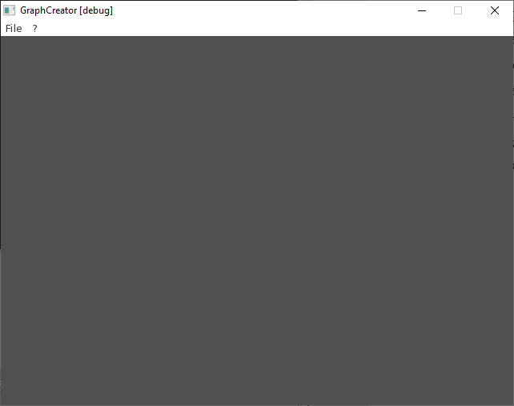
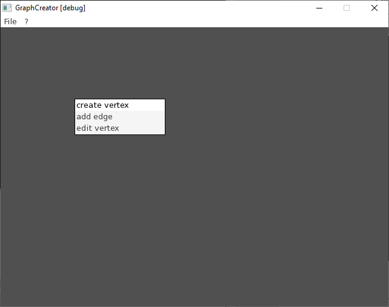
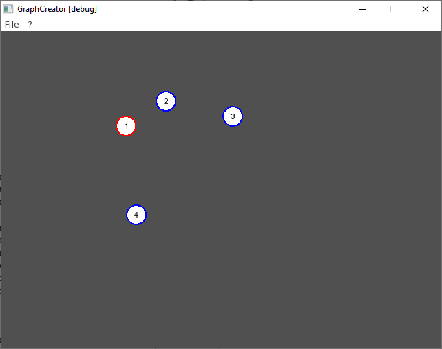
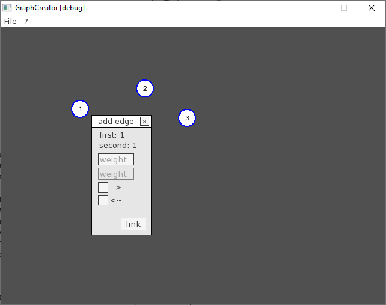

# Perm National Research Polytechnic University
# Laboratory work 2. An introduction to graph theory. Dijkstra and Floyd algorithms.

made with sfml

1. start window

# opportunities
# - create vertex

# - focus vertex

# - add edges

by student RIS-22-2b Mizev V.A.

